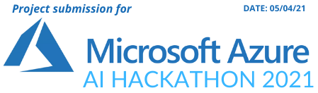
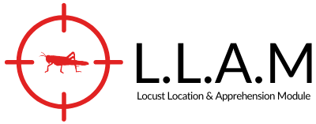
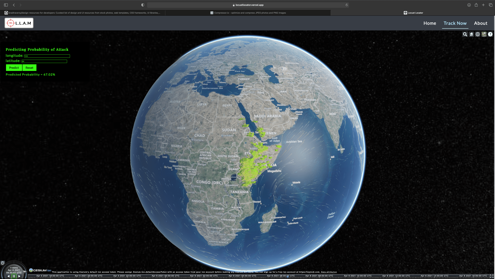
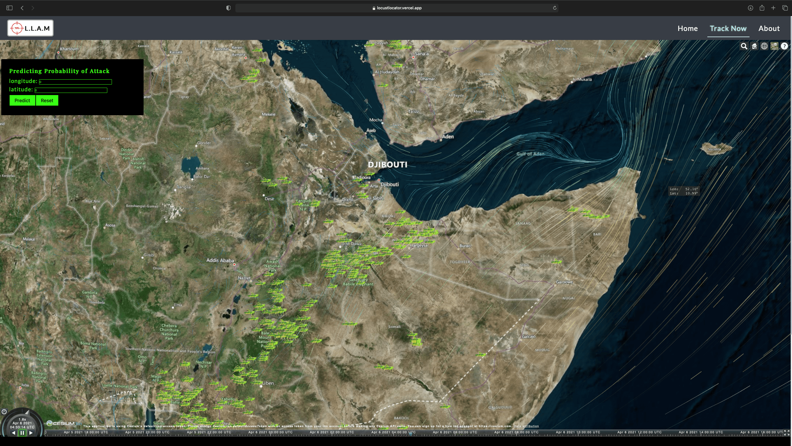
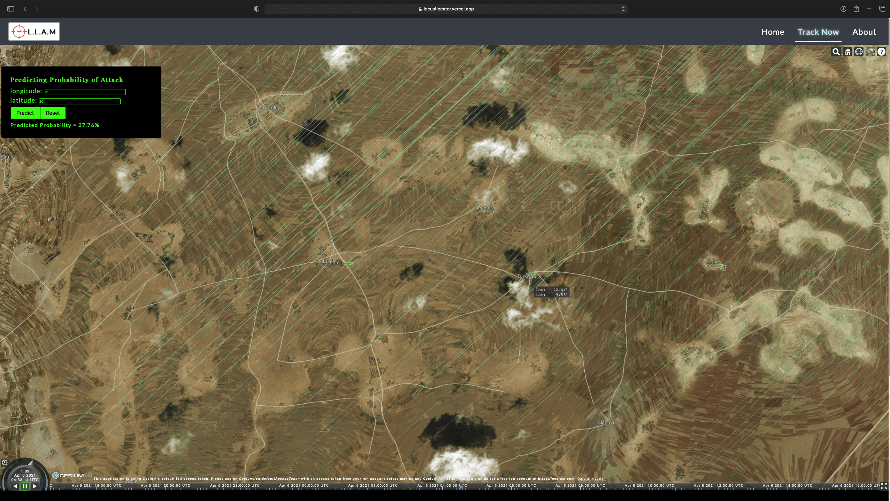
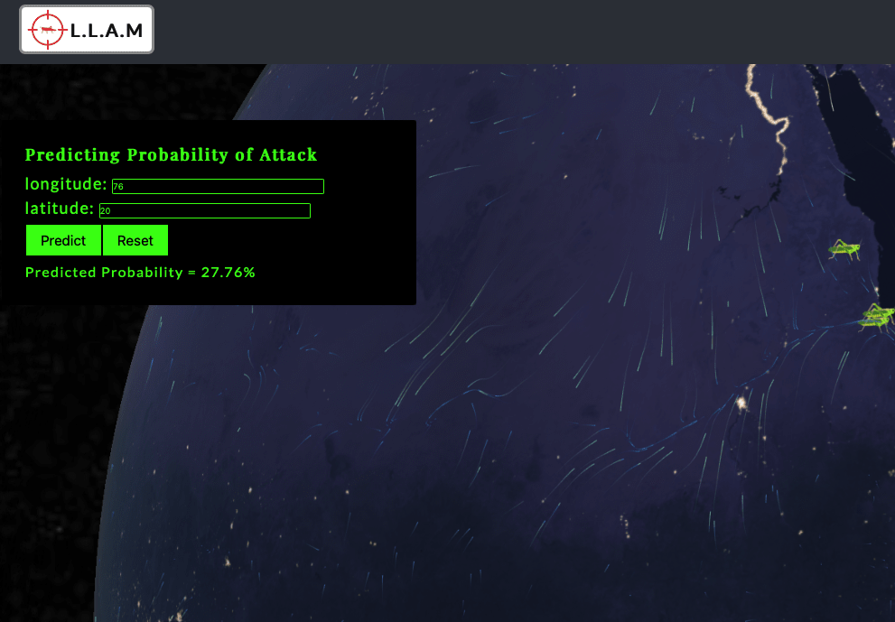

Project: L.L.A.M - Locust Location & Apprehension Module
=======================

>  "Save crops from locust attacks"

**Live Demo**: https://locustlocator.vercel.app 🔗

## What does this project do? 🤔

LLAM tracks the realtime locusts location and visualizes wind patterns on earth.
Predicts the probability of locust attacks on a particular given position through satellite imagery using machine learning models.

## Who did we design this project for? 👨🏻‍🌾

This project is designed keeping the problems that farmers face due to locusts in mind. We aim to reduce the destruction of crops caused by locusts which leads to massive effect on socio-economic interests of farmers.

## What was the inspiration for this project? 💡

The inspiration behind L.L.A.M was that locusts are increasingly becoming a great threat to the vegetation and this threat is reportedly going to increase each year. To safeguard crops and farmers from this plague we needed some solution that could tackle the problem well.


## What challenges did we run into? 🤯

- The first challenge we ran into was how will we collect the relevant data.
- Then we had to decide how will we visualize the frontend with that data.
- Changing code to fit our Next js frontend framework.
- Populate data with efficiency because alot of gpu power was required.
- Rendering terrains and maps in Cesium Js.

## What accomplishments are we most proud of? 👏

- Visualizing the data on 3d earth.
- ML model predictions from satellite imagery.
- Team did phenomenal job at helping each other and integrating stuff together. 

## What we learned ? 🧠

- Using Microsoft Azure services for creating sick APIs.
- Cesium Js framework to render and perform functions on 3D earth.
- Amazing Next Js features.

## What's next for L.L.A.M 🚀

- More optimization have to be made.
- 
- 


## More about the project 🔥

**Live Demo**: https://locustlocator.vercel.app

<h4 align="center">Tracking feature</h4>



<h4 align="center">Wind patterms and locusts vizualized</h4>



<h4 align="center">Zoomed in view of location where potential locust is found</h4>



<h4 align="center">Predicting locust attack on a particular location</h4>




Prerequisites
-------------

- [NextJS](https://nextjs.org)
- [Node.js 10+](http://nodejs.org)
- Command Line Tools
 - &nbsp;**Mac OS X:** [Xcode](https://itunes.apple.com/us/app/xcode/id497799835?mt=12) (or **OS X 10.9+**: `xcode-select --install`)
 - &nbsp;**Windows:** [Visual Studio](https://www.visualstudio.com/products/visual-studio-community-vs) OR [Visual Studio Code](https://code.visualstudio.com) + [Windows Subsystem for Linux - Ubuntu](https://docs.microsoft.com/en-us/windows/wsl/install-win10)
 - &nbsp;**Ubuntu** / &nbsp;**Linux Mint:** `sudo apt-get install build-essential`
 - &nbsp;**Fedora**: `sudo dnf groupinstall "Development Tools"`


Getting Started 🎬
---------------

The easiest way to get started is to clone the repository:

```bash
# Get the latest snapshot
git clone https://github.com/Jappan07/LLAM

# Change directory
cd LLAM

# Install NPM dependencies
npm install

# Then simply start your app
npm run dev
```


```bash
# project will start at localhost:3000
https://localhost:3000
```

**Note:** GPU intensive features are added into this project so it is suggested to run this application on a machine having dedicated gpu so that it could run smoothly. 


License
-------

The MIT License (MIT)

Copyright (c) 2021-3010 Hacker House

Permission is hereby granted, free of charge, to any person obtaining a copy of this software and associated documentation files (the "Software"), to deal in the Software without restriction, including without limitation the rights to use, copy, modify, merge, publish, distribute, sublicense, and/or sell copies of the Software, and to permit persons to whom the Software is furnished to do so, subject to the following conditions:

The above copyright notice and this permission notice shall be included in all copies or substantial portions of the Software.

THE SOFTWARE IS PROVIDED "AS IS", WITHOUT WARRANTY OF ANY KIND, EXPRESS OR IMPLIED, INCLUDING BUT NOT LIMITED TO THE WARRANTIES OF MERCHANTABILITY, FITNESS FOR A PARTICULAR PURPOSE AND NONINFRINGEMENT. IN NO EVENT SHALL THE AUTHORS OR COPYRIGHT HOLDERS BE LIABLE FOR ANY CLAIM, DAMAGES OR OTHER LIABILITY, WHETHER IN AN ACTION OF CONTRACT, TORT OR OTHERWISE, ARISING FROM, OUT OF OR IN CONNECTION WITH THE SOFTWARE OR THE USE OR OTHER DEALINGS IN THE SOFTWARE.
